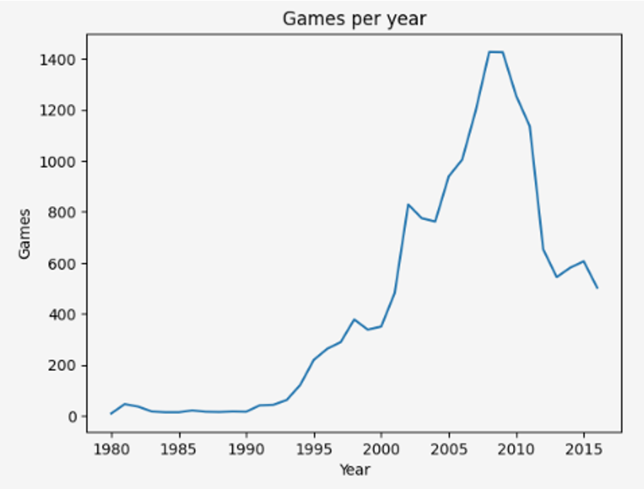
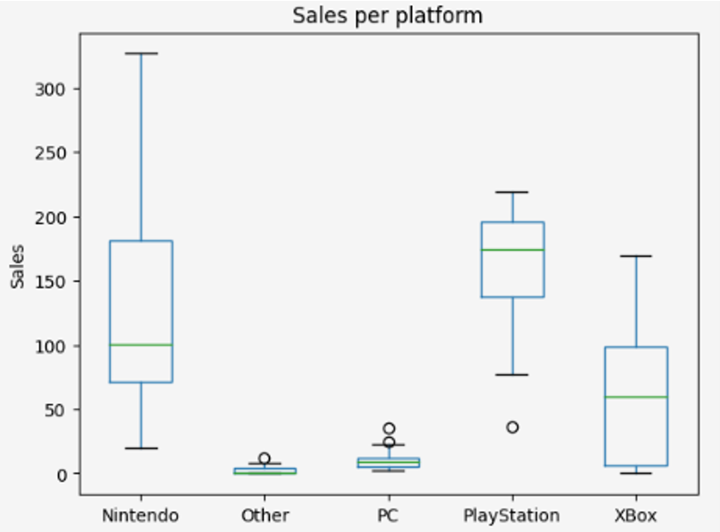
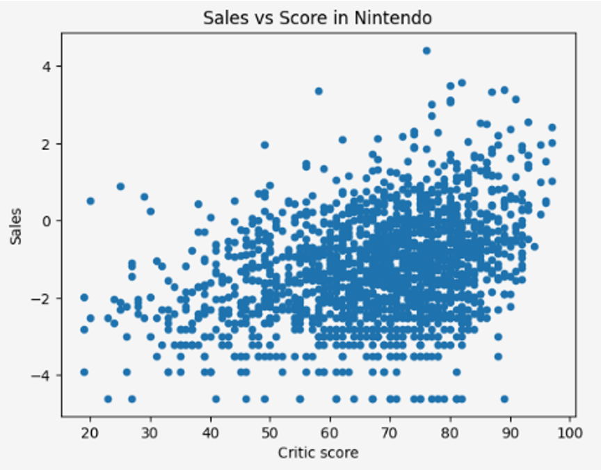

# My Journey Through Data

I'm Alondra Rubio, a Data Scientist with a background in computer systems engineering and 8+ years of professional experience in digital marketing, and now in data science and analytics. **I specialize in extracting insights, building predictive models, and creating data solutions that support strategic decision-making.**

My technical toolkit includes **Python, SQL, Power BI, and machine learning** techniques such as classification, clustering, time series forecasting, and recommender systems. I’ve led projects involving customer segmentation, behavioral analysis, data visualization, and automated reporting pipelines.

Beyond tools and models, I bring strong soft skills: **I’m a detail-oriented, results-driven professional who communicates clearly across teams**. I thrive in collaborative, remote environments where curiosity, adaptability, and continuous learning are valued.

What sets me apart is my ability to combine business understanding with technical precision — translating data into real impact.

Explore my portfolio to see how I turn complex data into actionable insights.

Feel free to contact me through the following channels

* * *

# Selected projects

## Marketing Strategy through Data Analysis 
Identification of patterns to determine whether a game is successful or not, allowing for the detection of promising projects and the planning of advertising campaigns. Identifying the key factors that determine whether a video game will be successful or not will allow the ICE online store to identify promising projects and plan its advertising campaigns and marketing strategies in advance.

### Tools and type of project

### Key questions
¿What is the sales pattern across different platforms?
¿What are game preferences by genre in different regions?
¿How can we check whether average user ratings are the same or different across platforms?

### Methodology
- **Data preprocessing:** The data was cleaned and standardized, removing inconsistencies and verifying the absence of duplicates and missing values.
- **Exploratory Data Analysis (EDA):** Demographic and behavioral characteristics were analyzed, identifying key factors that determine whether the video game will have a significant impact on sales.
- **Data visualization:** As part of the analysis, data visualizations were created to provide a more visual analysis of sales and user behavior.
- **Hypothesis testing:** Hypothesis tests were conducted to examine user ratings for specific video games, as well as differences in average sales across various platforms.

### Conclusions and recommendations

#### Factores críticos de retención
- Un factor que influye en las ventas son las críticas de los usuarios
- Las preferencias de género de videojuegos son similares en las regiones analizadas, permitiendo identificar los géneros preferidos

#### Recommended strategies
- **Custom Campaigns:** Design campaigns that highlight the key features of the games you're promoting.
- **Proactive Segmentation:** Classify customers by platform and gender to design retention and loyalty strategies.
- **Promote Strategic Activities:** Identify at-risk customers and offer interesting, targeted promotions.

### Featured Views
1. **Games per year:** Number of games released per year, where the most significant sales can be seen, which is a fundamental part to identify the main years in which video games began to gain strength.

2. **Sales by platform:** It is observed that there are platforms that have had quite acceptable performance (Nintendo, PlayStation, Xbox), as well as significant sales, so they can be considered among the 'favorites' of users.

3. **Sales vs. Score Correlation:** It can be seen that there is a certain relationship between scores and sales, especially the critics' scores have a little more influence than the users' scores, so it can be said that, to a certain extent, sales are also based on what the critics point out, since a large percentage of the population relies on product reviews to know whether or not to make a purchase, the same happens in this case with video games.

**Explore more details of the project in the [complete repository](https://github.com/alorubio/Proyecto_Ice_videojuegos_online).**

## Customer Similarity, Purchase probability, and Data Protection through machine learning
The goal of this project is to solve several challenges using machine learning. These include identifying customers similar to a given customer to support the marketing team, predicting the likelihood of a new customer receiving an insurance benefit, and estimating how many benefits they could receive using a predictive model. Additionally, it is necessary to protect customers' personal data.

#### Tools and project type

### Key Questions
1. ¿Is the client likely to receive an insurance benefit?
2. ¿Is it possible to predict the number of insurance benefits a new client might receive?
3. ¿Are there similarities between specific clients?

### Methodology
- **Data Preprocessing:** Data cleansing (missing values, duplicates, column formats, and appropriate data types).
- **Exploratory Data Analysis:** An analysis is performed to understand customer behavior.
- **Similar Customer Analysis:** An analysis is performed to identify and evaluate the likelihood of finding similar customers.
- **Probability of Receiving Benefits:** The probability is analyzed using various models: a trained dummy model, an untrained dummy model, and **linear regression**.
- **Data Obfuscation:** Customers' personal data is protected.
- **Correct Obfuscation Test:** Tests are performed to confirm that data obfuscation is working correctly.

### Conclusions and Recommendations

#### Critical Factors
- Through exploratory analysis, we found it somewhat difficult to identify groups with similarities.
- Machine learning was used to obtain similarities.

#### Recommendations
- Scaled and unscaled data must be evaluated to determine which provides the most accurate information.
- Different prediction models must be trained and evaluated to analyze and select the best model.
- When obfuscating data, testing must be performed to verify that it is functioning correctly and that no inconsistencies arise.

### Featured Visualizations
1. **Pair Chart:** The pair chart is used to identify similarities between customers. We can see that visually, no obvious groups can be detected, as it is difficult to combine several variables simultaneously.

**Explore more details of the project in the [complete repository](https://github.com/alorubio/Proyecto_Sure_Tomorrow_seguros).**

## Predictive Model for Taxi Orders During Peak Hours (Time Series)
The objective of this project is to analyze historical data collection on taxi orders at airports, with the goal of attracting more drivers during peak hours. This requires predicting the number of taxi orders for the next hour using a predictive model.

#### Tools and project type

### Key Questions
1. ¿Can taxi order trends be identified using historical data?
2. ¿Is the trend in full data the same as in a data extract?
3. ¿Is there a trend, seasonality, or stationarity in the analyzed data?

### Methodology
- **Data preprocessing:** Data cleaning (missing values, duplicates, column formats, and appropriate data types).
- **Exploratory data analysis:** Data resampling is performed, and data and order behavior are analyzed.
- **Predictive model training:** Feature generation, data sets are split, and predictive models are trained.
- **Testing:** Pre-trained models are tested to analyze the results.

### Conclusions and Recommendations

#### Recommendations
- Data extraction is necessary to provide a more detailed view and a chance to detect trends.
- Data must be broken down by trend, seasonality, and residuals to analyze and compare the results.
- Different prediction models must be trained and evaluated to analyze and select the best model.

For this application, the most appropriate model is CatBoostRegressor. Although all models performed below the metric proposed in the project description, the CatBoostRegressor model is the model that yields the smallest RECM error for the test set, and also a low error for the training set, making it the most suitable model to use in this taxi ordering project.

### Featured Visualizations
1. **Full trend chart:** It can be seen that the number of records tends to increase over time, however, nothing specific can be defined regarding seasonality since the information is not clearly visible.

2. **Information extract trend graph:** When viewing the extract that was made, the seasonality is quite similar, and the residuals remain linear.

**Explore more details of the project in the [complete repository](https://github.com/alorubio/Prediccion-pedidos-taxis-en-horas-pico.git).**
